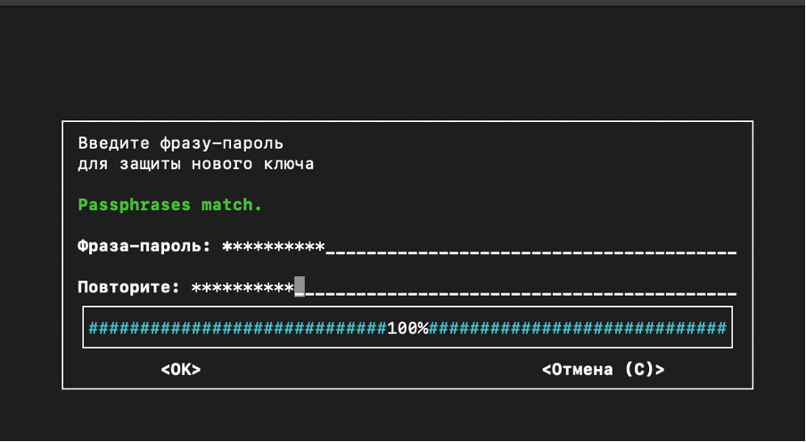
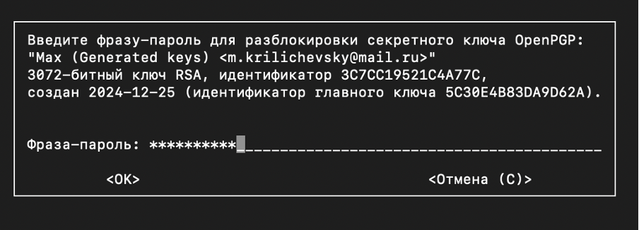

# Отчет о выполнении домашнего задания

## Тема: шифрование файлов и каталогов
#
#### Выполнил: Криличевский М. Е.
#### ИСУ: 364449
#### Группа: К3139
#
### Цель домашней работы:  
Познакомиться с основными принципами шифрования данных, изучить инструменты шифрования/расшифровки файлов, освоить управление ключами, а также практиковаться в обеспечении конфиденциальности данных с использованием GnuPG.
#
### Ход работы:
##### 1. Создание директории `data_task_backup` и наполнеие её файлами:

##### 2. Архивация директории:

##### 3. Генерация ключей для асимметричного шифрования
>gpg --full-generate-key
>gpg --list-keys

##### 4. Шифрование файла с использованием публичного ключа

##### 5. Удаление оригинальной директории и файла архива

##### 6. Расшифровка файла для проверки восстановления данных
>gpg --output data_backup_decrypted.tar.gz --decrypt data_backup.tar.gz.gpg

#
### Вывод: 
В процессе работы познакомился с алгоритмами шифрования папок и каталогов, а также поработал с GnuPG, для выполнения поставенной задачи.

